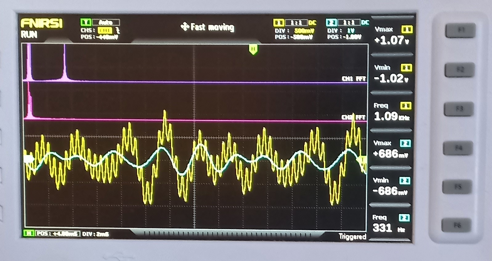

# i2s-dac

Uses a DAC (mcu1334) to output sinewaves. With the help of a scope you will see a high and low frequency mixed signal in the LEFT Channel of the DAC  and a filtred signal in the
RIGHT Channel. A Low Pass FIR filter is applied in the RIGHT Channel.

```
 WS/LRCK > PB12  (I2S2_WS,  AF5)
 BCK/SCK > PB13  (I2S2_CK,  AF5)
 DIN     > PB15  (I2S2_SD,  AF5)
 MCLK    > PC6   (I2S2_MCK, AF5)  (optional, connect if your module has a MCLK pin)
 VIN     > 3.3 V
 GND     > GND

```
you can edit the cutoff frequency of the FIR filter in ```filter_coeffs.c```, build the firmware running ```make``` and flashing ```make flashbin```

RESULT:

<p align="center">
  
</p>
